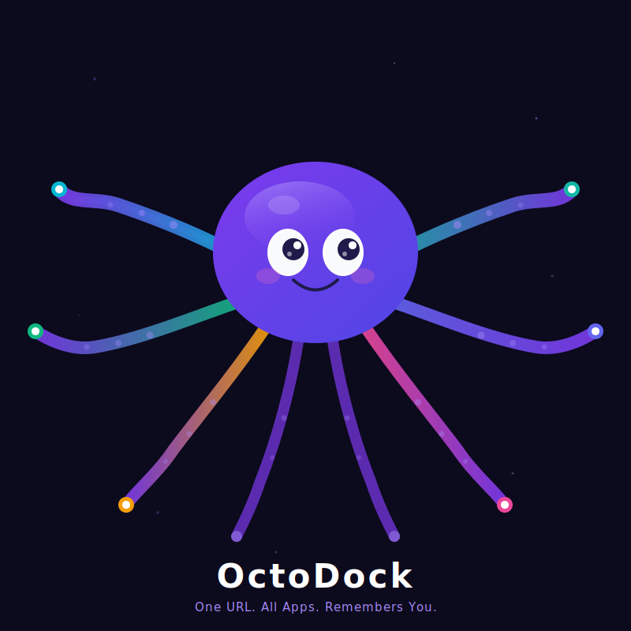

<p align="center">
  
</p>

<h1 align="center">OctoDock</h1>

<p align="center">
  <strong>One URL. All Apps. Remembers You.</strong>
</p>

<p align="center">
  <a href="https://octo-dock.com">Website</a> · <a href="#quick-start">Quick Start</a> · <a href="#connected-apps">Connected Apps</a> · <a href="#adding-a-new-adapter">Add Your App</a>
</p>

<p align="center">
  <a href="LICENSE"></a>
  
  
</p>

---

## What is OctoDock?

Most people connect MCP servers one app at a time. Each one dumps 20+ tool definitions into the AI's context window, eating thousands of tokens per turn.

**OctoDock gives your AI just 2 tools:**

| Tool | What it does |
|------|-------------|
| `octodock_do` | Execute any action on any connected app |
| `octodock_help` | Get available apps and actions on demand |

That's ~300 tokens instead of 50,000+. Your AI picks the right action every time because it's choosing from 2, not 65.

### The magic: it remembers you

Every operation flows through OctoDock. Over time, it learns:
- Your Notion folder names → auto-resolves to page IDs
- Your common workflows → suggests shortcuts
- Your preferences → adapts across all AI platforms

Switch from Claude to ChatGPT? Your memory follows you.

## Quick Start

### Use the hosted version

1. Go to [octo-dock.com](https://octo-dock.com)
2. Sign in, connect your apps
3. Copy your MCP URL → paste into Claude / ChatGPT settings
4. Done.

### Self-host

```bash
git clone https://github.com/chaosmibu-blip/OctoDock.git
cd octodock
cp .env.example .env    # Edit with your OAuth credentials
docker compose up       # PostgreSQL + pgvector + OctoDock
```

Open `http://localhost:3000`, sign in, connect your apps, copy your MCP URL.

### Generate encryption key

```bash
node -e "console.log(require('crypto').randomBytes(32).toString('hex'))"
```

## Architecture

```
You → Claude/ChatGPT → octodock_do("notion", "create_page", {title: "Meeting"})
                              ↓
                        OctoDock MCP Server
                              ↓
                  ┌─── Memory Engine (resolves folder name → ID)
                  ├─── Adapter Registry (finds Notion adapter)
                  ├─── OAuth Manager (gets valid token)
                  └─── Notion API → Done
                              ↓
                  { ok: true, url: "https://notion.so/..." }
```

## Connected Apps

| App | Actions | Auth |
|-----|---------|------|
| Notion | 21 | OAuth |
| Gmail | 7 | OAuth |
| Google Calendar | 5 | OAuth |
| Google Drive | 3 | OAuth |
| Google Docs | 5 | OAuth |
| Google Sheets | 4 | OAuth |
| GitHub | 29 | OAuth |
| LINE | 5 | API Key |
| Telegram | 4 | Bot Token |
| Threads | 5 | OAuth |
| Instagram | 5 | OAuth |
| YouTube | 3 | OAuth |

**Adding a new app = adding one file in `src/adapters/`.** The core system auto-discovers it.

## Features

- **2-Tool MCP** — `octodock_do` + `octodock_help`. ~300 tokens vs 50,000+.
- **Memory Engine** — pgvector semantic search. Learns your names, patterns, preferences.
- **Name Resolution** — Say "Meeting Notes" instead of `317a9617-...`. Auto-resolves via memory.
- **Format Conversion** — Reads return Markdown, writes accept Markdown. Symmetric I/O.
- **SOP System** — Markdown workflow documents. AI reads and executes step-by-step.
- **Scheduler** — Cron-based automation. Simple tasks = free. Complex = internal AI (Haiku).
- **Pattern Analyzer** — Auto-detects frequent actions and default folders.

## Tech Stack

TypeScript, Next.js (App Router), PostgreSQL + pgvector, Drizzle ORM, NextAuth.js, AES-256-GCM, @modelcontextprotocol/sdk

## Project Structure

```
src/
├── adapters/           # One file per app (auto-discovered)
├── mcp/
│   ├── server.ts       # octodock_do + octodock_help
│   ├── registry.ts     # Auto-discovery
│   ├── system-actions.ts   # Memory, SOP, scheduler
│   └── pattern-analyzer.ts
├── services/
│   ├── memory-engine.ts    # pgvector + learn/resolve
│   ├── scheduler.ts        # Cron automation
│   └── internal-ai.ts      # Claude Haiku
└── app/                # Next.js routes + Dashboard
```

## Adding a New Adapter

1. Create `src/adapters/your-app.ts`
2. Implement `AppAdapter`: `actionMap`, `getSkill()`, `formatResponse()`, `execute()`
3. Done. Registry auto-discovers it.

See `.claude/skills/adapter-quality-checklist.md` for quality guidelines.

## License

[Business Source License 1.1](LICENSE) — Free to use, modify, and self-host. You may not offer a competing hosted service. Converts to MIT automatically after 4 years.
